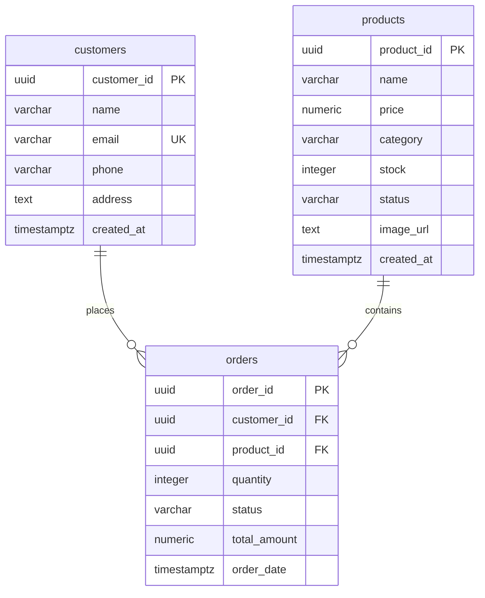

# ShopSphere – Database Schema Overview

This document acts as the structural overview of the ShopSphere database layout, detailing columns, indexes, keys, constraints, and bucket structures configured in Supabase.

---

## 1. Entity Relationship Mapping



---

## 2. Table Structures

### A. Table: `products`
Holds metadata, pricing, and stock details of store products.

| Column | Data Type | Constraints / Default | Description |
| :--- | :--- | :--- | :--- |
| `product_id` | `uuid` | Primary Key, `gen_random_uuid()` | Unique product identification code. |
| `name` | `varchar(255)` | `NOT NULL` | The catalog display title. |
| `price` | `numeric(10, 2)` | `NOT NULL`, `CHECK (price >= 0)` | Purchase price with scale 2 decimals. |
| `category` | `varchar(100)` | `NOT NULL` | Group classification of product. |
| `stock` | `integer` | `NOT NULL`, `DEFAULT 0`, `CHECK (stock >= 0)` | Available physical inventory. |
| `status` | `varchar(50)` | `NOT NULL`, `DEFAULT 'Draft'`, `CHECK (status IN ('Active', 'Draft', 'Out of Stock'))` | Display visibility configuration. |
| `image_url` | `text` | `NULL` | Link to photo asset in storage bucket. |
| `created_at` | `timestamptz` | `NOT NULL`, `DEFAULT now()` | UTC record creation date. |

### B. Table: `customers`
Holds contact profiles of registered store customers.

| Column | Data Type | Constraints / Default | Description |
| :--- | :--- | :--- | :--- |
| `customer_id` | `uuid` | Primary Key, `gen_random_uuid()` | Unique customer identification code. |
| `name` | `varchar(255)` | `NOT NULL` | Customer's full name. |
| `email` | `varchar(255)` | `UNIQUE`, `NOT NULL` | Primary email (validated format). |
| `phone` | `varchar(50)` | `NULL` | Contact telephone number. |
| `address` | `text` | `NULL` | Deliverable shipping street address. |
| `created_at` | `timestamptz` | `NOT NULL`, `DEFAULT now()` | UTC signup timestamp. |

### C. Table: `orders`
Holds transactional sales logs mapping checkouts.

| Column | Data Type | Constraints / Default | Description |
| :--- | :--- | :--- | :--- |
| `order_id` | `uuid` | Primary Key, `gen_random_uuid()` | Unique transaction reference code. |
| `customer_id` | `uuid` | Foreign Key -> `customers.customer_id`, `ON DELETE RESTRICT` | Buying client profile link. |
| `product_id` | `uuid` | Foreign Key -> `products.product_id`, `ON DELETE RESTRICT` | Target catalog item link. |
| `quantity` | `integer` | `NOT NULL`, `CHECK (quantity > 0)` | Quantity purchased. |
| `status` | `varchar(50)` | `NOT NULL`, `DEFAULT 'Pending'`, `CHECK (status IN ('Pending', 'Packed', 'Shipped', 'Delivered'))` | Order lifecycle stage. |
| `total_amount` | `numeric(10, 2)` | `NOT NULL`, `CHECK (total_amount >= 0)` | Snapshotted aggregate cost (price * qty). |
| `order_date` | `timestamptz` | `NOT NULL`, `DEFAULT now()` | UTC checkout timestamp. |

---

## 3. Storage Bucket Configuration

* **Bucket Name**: `product-images`
* **Access Policy**: **Public** (allows anonymous GET requests to view images via static public URLs).
* **Upload Permissions**: Restricted to authenticated dashboard administrators only.

---

## 4. Query Optimizing Indexes
These indexes optimize search and query execution times on the dashboard tables:
```sql
create index idx_products_category on public.products(category);
create index idx_products_status on public.products(status);
create index idx_orders_customer on public.orders(customer_id);
create index idx_orders_status on public.orders(status);
```
