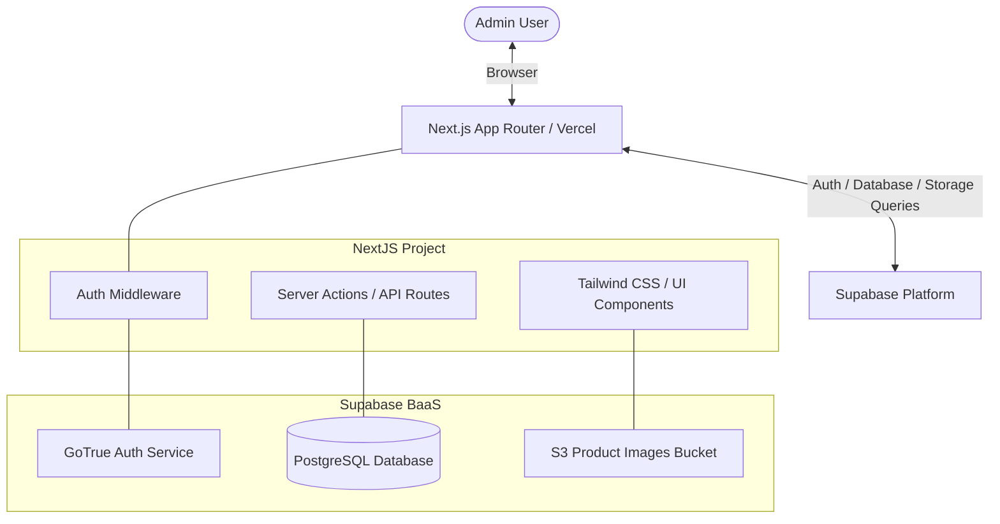
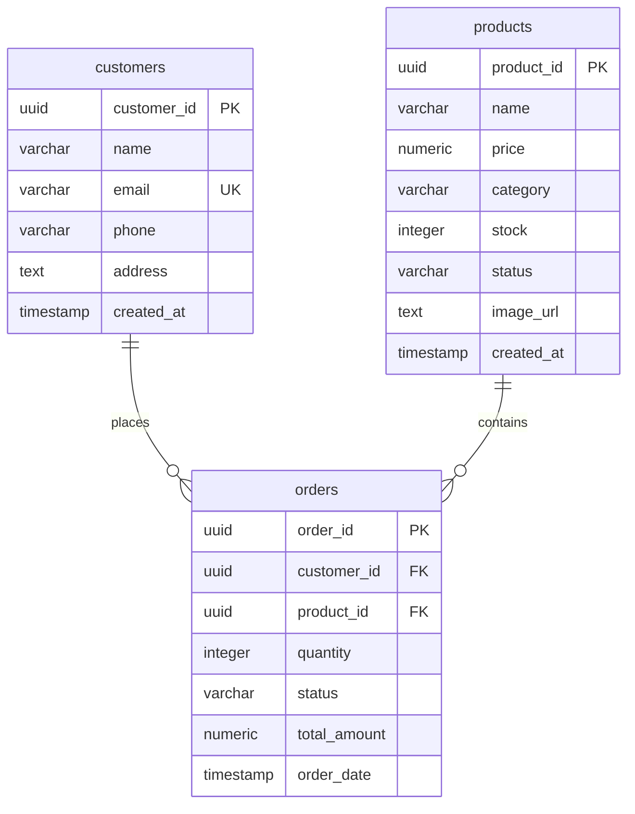

# ShopSphere – Design Document

ShopSphere is a full-stack e-commerce admin and order management system built with Next.js and Supabase. This document details the technical design, database schema, routing structure, component architecture, and security policies of the platform.

---

## 1. System Architecture

ShopSphere follows a modern serverless architecture combining a Next.js frontend with Supabase as a Backend-as-a-Service (BaaS).



### Technology Breakdown
- **Frontend Framework**: Next.js 14+ (App Router)
- **Styling**: Tailwind CSS (supporting both dark and light modes, modern glassmorphism UI)
- **Database**: PostgreSQL (hosted on Supabase)
- **Authentication**: Supabase Auth (Email & Password login for Admin)
- **Storage**: Supabase Storage Buckets (for product image uploads)
- **Hosting**: Vercel (Frontend) and Supabase (Backend)

---

## 2. Database Schema Design

The Postgres database consists of three main tables: `products`, `customers`, and `orders`. Relationships are enforced using foreign keys.



### Table Definitions & SQL Schema

```sql
-- Enable UUID extension if not already enabled
create extension if not exists "uuid-ossp";

-- 1. PRODUCTS TABLE
create table public.products (
    product_id uuid default gen_random_uuid() primary key,
    name varchar(255) not null,
    price numeric(10, 2) not null check (price >= 0),
    category varchar(100) not null,
    stock integer not null default 0 check (stock >= 0),
    status varchar(50) not null default 'Out of Stock', -- 'Active', 'Draft', 'Out of Stock'
    image_url text,
    created_at timestamp with time zone default timezone('utc'::text, now()) not null
);

-- 2. CUSTOMERS TABLE
create table public.customers (
    customer_id uuid default gen_random_uuid() primary key,
    name varchar(255) not null,
    email varchar(255) unique not null,
    phone varchar(50),
    address text,
    created_at timestamp with time zone default timezone('utc'::text, now()) not null
);

-- 3. ORDERS TABLE
create table public.orders (
    order_id uuid default gen_random_uuid() primary key,
    customer_id uuid references public.customers(customer_id) on delete cascade not null,
    product_id uuid references public.products(product_id) on delete restrict not null,
    quantity integer not null check (quantity > 0),
    status varchar(50) not null default 'Pending', -- 'Pending', 'Packed', 'Shipped', 'Delivered'
    total_amount numeric(10, 2) not null check (total_amount >= 0),
    order_date timestamp with time zone default timezone('utc'::text, now()) not null
);

-- Indexes for performance optimization
create index idx_products_category on public.products(category);
create index idx_products_status on public.products(status);
create index idx_orders_customer on public.orders(customer_id);
create index idx_orders_status on public.orders(status);
```

---

## 3. Directory and Routing Structure

Next.js App Router will be structured as follows:

```text
shopsphere/
├── app/
│   ├── (auth)/
│   │   └── login/
│   │       └── page.tsx          # Admin Login UI
│   ├── (dashboard)/
│   │   ├── layout.tsx            # Main sidebar and navbar layout
│   │   ├── page.tsx              # Dashboard metrics, analytics, low stock alerts
│   │   ├── products/
│   │   │   ├── page.tsx          # Product listing, search & filter interface
│   │   │   └── add/
│   │   │       └── page.tsx      # Add product form / modal container
│   │   ├── orders/
│   │   │   └── page.tsx          # Order management, status updates
│   │   └── customers/
│   │       └── page.tsx          # Customer base listing & search
│   ├── api/
│   │   └── invoice/
│   │       └── route.ts          # Endpoint to generate/download invoice PDFs
│   ├── globals.css
│   ├── layout.tsx
│   └── middleware.ts             # Auth check / redirects if not logged in
├── components/
│   ├── ui/
│   │   ├── button.tsx
│   │   ├── card.tsx
│   │   ├── input.tsx
│   │   ├── select.tsx
│   │   └── table.tsx
│   ├── sidebar.tsx               # Admin navigation sidebar
│   ├── navbar.tsx                # Admin header bar / profile indicator
│   └── charts/
│       ├── sales-chart.tsx       # Chart showing revenue analytics
│       └── stock-chart.tsx       # Low stock alerts chart
├── lib/
│   ├── supabase/
│   │   ├── client.ts             # Supabase client-side config
│   │   └── server.ts             # Supabase server-side config (Server Actions)
│   └── utils.ts                  # Tailwind class merge, date formatting
├── public/
│   └── assets/                   # Static icons and fallback images
├── types/
│   └── database.types.ts         # Autogenerated Supabase DB types
├── package.json
└── tailwind.config.js
```

---

## 4. UI & Interface Design

ShopSphere employs a premium, high-contrast dark theme with glowing neon accents (emerald for active/revenue, amber for warnings/pending, and indigo for primary operations) designed to wow users on first load.

### Key Visual Guidelines
- **Theme**: Dark mode by default (slate-900 background) featuring smooth semi-transparent card overlays (glassmorphism: `backdrop-blur-md bg-white/5 border border-white/10`).
- **Typography**: Inter (primary font family) for readability and modern look.
- **Micro-animations**: Subtle scale-up on button hovers (`hover:scale-105 active:scale-95 transition-all duration-200`) and smooth sidebar transitions.

### Core Layout Layout Wireframes

```text
+-------------------------------------------------------------+
|  [Logo] ShopSphere   |  Search...              [Admin Head] |
+----------------------+--------------------------------------+
|                      |                                      |
|  * Dashboard         |  DASHBOARD METRICS                   |
|  * Products          |  +---------+ +---------+ +---------+ |
|  * Orders            |  |Revenue  | |Orders   | |Products | |
|  * Customers         |  |$12.5k   | |148      | |32       | |
|                      |  +---------+ +---------+ +---------+ |
|  * Settings          |                                      |
|                      |  LOW STOCK ALERTS                    |
|                      |  - Wireless Mouse (2 left)           |
|                      |  - Mechanical Keyboard (0 left)      |
|  [Logout Button]     |                                      |
+----------------------+--------------------------------------+
```

---

## 5. Key System Workflows

### 5.1 Admin Authentication Flow
- **Middleware Check**: For every page request under the dashboard, `middleware.ts` checks for a valid Supabase auth token. If missing, it redirects the browser to `/login`.
- **Login Flow**:
  1. Admin enters credentials at `/login`.
  2. The page invokes `supabase.auth.signInWithPassword()`.
  3. Upon success, redirect to `/` (dashboard page).

### 5.2 Product Management & Storage Flow
- **Adding/Editing Products**:
  1. The Admin opens the "Add Product" form.
  2. If an image is selected, the file is uploaded to the Supabase Storage bucket `product-images` using `supabase.storage.from('product-images').upload()`.
  3. The public URL is generated and saved under the `image_url` field in the database.
  4. The form submits a write query to the `products` table.

### 5.3 Order Lifecycle Management
- **Status Updates**:
  1. Admin opens `/orders` and clicks on an order to change status.
  2. Options: `Pending` -> `Packed` -> `Shipped` -> `Delivered`.
  3. Upon selection, an update query is triggered.
  4. Real-time updates can optionally be handled via Supabase Postgres Changes subscription.

---

## 6. Security and Access Control

To protect customer and business data, database operations are secured using **Row-Level Security (RLS)** in Supabase.

### Proposed RLS Policies
Only authenticated administrators are allowed read, write, and delete operations on database tables.

```sql
-- Enable Row-Level Security on all tables
alter table public.products enable row level security;
alter table public.customers enable row level security;
alter table public.orders enable row level security;

-- Create policies requiring user to be authenticated
create policy "Allow read/write access to authenticated admins only"
on public.products
to authenticated
using (true)
with check (true);

create policy "Allow read/write access to authenticated admins only"
on public.customers
to authenticated
using (true)
with check (true);

create policy "Allow read/write access to authenticated admins only"
on public.orders
to authenticated
using (true)
with check (true);
```

---

## 7. AI Enhancement (Future Implementation)
- **AI Inventory Forecasting**: Integrate a database function (or edge function) using standard statistical regression or machine learning to predict stock depletion rates based on historical orders.
- **Sales Analytics**: Generate natural language reports based on sales trends via an AI prompt endpoint.
